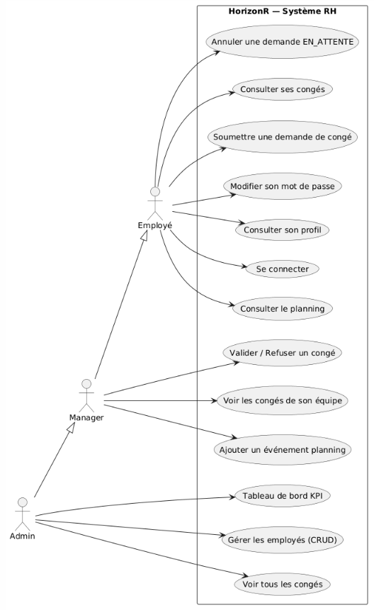
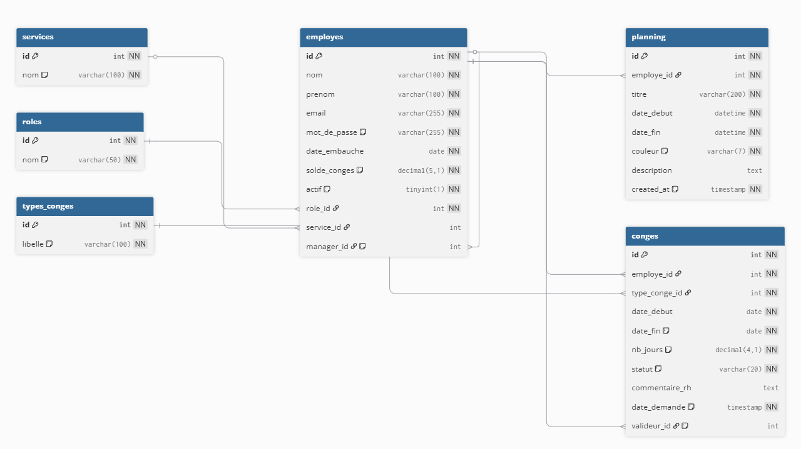

# HorizonR — Application de Gestion des Ressources Humaines

> **BTS SIO SLAM — Réalisation professionnelle E5**

---

## Présentation de l'entreprise

L'entreprise fictive dans laquelle s'inscrit cette réalisation est la société **NovaTech Solutions**, une PME spécialisée dans le développement et l'intégration de solutions informatiques pour le secteur tertiaire.

Créée en 2015, l'entreprise est située à Nice et compte **47 salariés**, répartis en cinq services :

- **Développement** (15 développeurs)
- **Infrastructure** (8 administrateurs systèmes et réseaux)
- **Commercial** (10 chargés de compte)
- **Direction & RH** (4 personnes)
- **Support Technique** (10 techniciens)

L'activité repose sur des projets clients à cycle court et une forte mobilité interne, ce qui rend la gestion des congés et du planning particulièrement sensible au quotidien.

---

## Intitulé de la réalisation

Conception et développement d'une application web Full-Stack de gestion des ressources humaines (employés, congés, planning, tableau de bord) pour le suivi quotidien des équipes et des administrateurs RH.

---

## Description

Ce projet est une **application web RH** développée en **Node.js 20** et **Express.js 4.18** côté serveur, avec un frontend en **HTML5 / CSS3 / JavaScript Vanilla**, conçue pour gérer les **employés**, les **congés** et le **planning** d'une PME.

**Atouts Node.js / Express :**

- évolutivité et performance sur les I/O
- écosystème npm riche, déploiement facilité via Docker
- langage unique JavaScript front et back (réduction du contexte-switching)

**Inconvénients Node.js / Express :**

- aucune structure imposée par le framework (risque de "fat controller", résolu par l'architecture 3 couches Repository / Service / Controller)
- gestion asynchrone à maîtriser
- pas de couche ORM native

**Atouts JavaScript Vanilla (frontend) :**

- aucune dépendance extérieure, chargement rapide
- contrôle total du code, compétence transférable sans framework

**Inconvénients JavaScript Vanilla :**

- plus verbeux qu'un framework comme React ou Vue
- gestion manuelle du DOM

**Atouts MySQL 8.0 :**

- base relationnelle éprouvée, contraintes d'intégrité fortes (FK, CHECK, ENUM)
- performante pour les jointures multi-tables, bien supportée par `mysql2`

**Inconvénients MySQL 8.0 :**

- nécessite un serveur dédié (résolu via Docker)
- configuration réseau entre conteneurs à soigner

> L'application est déployable en une seule commande : `docker compose up --build`.
> Elle est conçue pour une utilisation multi-utilisateurs avec trois niveaux de droits : **ADMIN**, **MANAGER**, **EMPLOYE**.

---

## Contexte organisationnel

Dans le cadre de la formation BTS SIO option SLAM, la réalisation est placée dans un contexte de PME à taille humaine ayant besoin d'un outil interne fiable pour centraliser la gestion RH.

Le besoin principal est de remplacer une gestion dispersée (fichiers Excel, emails) par une application unique permettant :

- de gérer les fiches employés et leurs droits d'accès,
- de soumettre, suivre et valider des demandes de congés,
- de consulter et alimenter un planning partagé,
- de disposer d'indicateurs RH en temps réel (tableau de bord Admin).

---

## Déclencheur et besoin

NovaTech Solutions connaît une croissance de ses effectifs. Le service RH ne dispose d'aucun outil dédié pour piloter les demandes de congés ou visualiser les absences à venir. Le suivi est actuellement réalisé via des tableurs et des échanges par email.

Cette organisation entraîne plusieurs problématiques :

- dispersion des informations entre plusieurs fichiers,
- risque d'erreur sur les soldes de congés (calcul manuel),
- absence de visibilité pour les managers sur les absences de leur équipe,
- pas de traçabilité des décisions de validation ou refus.

Face à ces limites, la direction souhaite une application interne accessible via navigateur, sécurisée par rôle, permettant de centraliser l'ensemble des données RH.

Le besoin fonctionnel est de permettre à chaque utilisateur de :

- consulter et gérer les employés (Admin),
- soumettre des demandes de congés et suivre leur statut (tous rôles),
- valider ou refuser les congés de son équipe (Admin et Manager),
- visualiser un planning hebdomadaire partagé,
- consulter des KPI RH sur un tableau de bord (Admin),
- modifier ses informations de profil et son mot de passe.

---

## Objectifs de la solution

- Proposer une application web stable, déployable en local via Docker et sur un serveur.
- Couvrir les opérations CRUD sur les données métier.
- Sécuriser les accès par JWT et RBAC (Role-Based Access Control).
- Garantir l'intégrité des données avec des validations centralisées côté API.
- Structurer l'API REST selon le pattern MVC 3 couches (Repository / Service / Controller) pour isoler la logique métier et faciliter les tests.
- Couvrir l'ensemble des composants par des tests automatiques (Jest) avec une couverture > 90 %.
- Fournir une base exploitable pour la démonstration orale BTS SIO.

---

## Accès à l'application

L'application est déployée sur un serveur distant et accessible à l'adresse suivante :

**https://horizonr.iris.a3n.fr:4433/pages/login.html**

| Rôle    | Email                     | Mot de passe |
| ------- | ------------------------- | ------------ |
| Admin   | sophie.martin@novatech.fr | Password1!   |
| Manager | thomas.leroy@novatech.fr  | Password1!   |
| Employé | antoine.petit@novatech.fr | Password1!   |

> Tous les 47 employés partagent le mot de passe `Password1!`

---

## Périmètre de la réalisation

### Inclus

- Application web multi-rôles avec interface responsive HTML/CSS/JS.
- API REST Express.js structurée par ressource (auth, employes, conges, planning, dashboard, profil).
- Base MySQL conteneurisée avec initialisation automatique (scripts `init.sql` + `seed.sql`).
- Authentification JWT stateless avec expiration configurable.
- Middleware RBAC générique appliqué route par route.
- Gestion CRUD des employés, congés, événements planning.
- Tableau de bord Admin avec 4 graphiques Chart.js.
- Calcul automatique des jours ouvrés (hors week-ends).
- Déduction automatique du solde de congés à la validation.
- Architecture 3 couches (Repository / Service / Controller) pour les 6 entités métier.
- Suite de tests Jest : 189 tests unitaires (20 suites) + 30 tests d'intégration (3 suites), couverture > 90 %.

### Hors périmètre

- Notifications email (envoi d'emails lors d'une validation/refus).
- Calendrier de gestion des jours fériés nationaux.
- Export PDF ou Excel des données RH.
- Authentification multi-facteur (2FA).
- Application mobile native.

### Diagramme des cas d'utilisation (UML)



---

## Contraintes

### Contraintes fonctionnelles

- Intégrité des données RH (formats de dates, champs obligatoires, solde non négatif).
- Cloisonnement strict des données : un employé ne voit que ses propres données, un manager uniquement son équipe.
- Navigation fluide entre les pages sans rechargement intégral (SPA-like via fetch/JSON).

### Contraintes techniques

- Node.js 20.
- Express.js 4.18.
- MySQL 8.0 (via driver `mysql2` 3.9.2).
- JWT (`jsonwebtoken` 9.0.2) + bcrypt (5.1.1).
- Docker & Docker Compose.
- Tests avec Jest 29.
- Couverture de code avec Istanbul (`jest --coverage`).

### Contraintes organisationnelles

- Réalisation individuelle.
- Code testable et démontrable en local (`docker compose up --build`).
- Documentation exploitable pour l'oral (MCD, MLD, MPD, guide utilisateur, fiche de réalisation).

---

## Structure de l'application

### Backend — `backend/src/`

#### `config/`

- `db.js` : création du pool de connexions MySQL2 (variables d'environnement + valeurs par défaut)

#### `middleware/`

- `auth.js` : vérifie le token JWT dans le header `Authorization: Bearer`, injecte `req.utilisateur`
- `role.js` : middleware RBAC générique — `role('ADMIN', 'MANAGER')` — retourne 403 si rôle insuffisant

#### `routes/`

- Un fichier par ressource : `auth.js`, `employes.js`, `conges.js`, `planning.js`, `dashboard.js`, `profil.js`
- Les routes appliquent `auth` globalement puis `role(...)` sur les endpoints sensibles

#### `repositories/`

- Un fichier par ressource : accès SQL pur, aucune logique métier
- `authRepository.js`, `congesRepository.js`, `dashboardRepository.js`, `employesRepository.js`, `planningRepository.js`, `profilRepository.js`

#### `services/`

- Un fichier par ressource : logique métier isolée, appelle le repository correspondant
- Retournent `{ error: 'CODE' }` en cas d'erreur métier (ex. : `SOLDE_INSUFFISANT`, `CHEVAUCHEMENT`)
- `authService.js`, `congesService.js`, `dashboardService.js`, `employesService.js`, `planningService.js`, `profilService.js`

#### `controllers/`

- Un fichier par ressource : couche HTTP uniquement (lecture `req`, appel service, écriture `res`)
- `authController.js` : login, logout
- `employesController.js` : CRUD employés + listes services/rôles
- `congesController.js` : CRUD congés
- `planningController.js` : liste, création, suppression d'événements
- `dashboardController.js` : KPI Admin
- `profilController.js` : consultation et mise à jour du profil connecté

#### `app.js`

- Point d'entrée Express : montage des routes, middlewares globaux (CORS, JSON), gestion 404 et erreurs globales

### Frontend — `frontend/`

#### `js/`

- `auth.js` : gestion localStorage (token + utilisateur), `requireAuth()`, `requireRole()`
- `api.js` : wrapper fetch centralisé — injecte le Bearer token, intercepte les 401
- Un fichier JS par page : `login.js`, `dashboard.js`, `employes.js`, `conges.js`, `planning.js`, `profil.js`, `sidebar.js`, `toast.js`

#### `pages/`

- Une page HTML par fonctionnalité : `login.html`, `dashboard.html`, `employes.html`, `conges.html`, `planning.html`, `profil.html`

#### `css/`

- `style.css` : feuille de style globale avec variables CSS (thème, couleurs, sidebar)

---

## Organisation du code

### Backend (backend/src/)

- `app.js` : point d'entrée Express, configuration CORS, enregistrement des routes.
- `config/db.js` : pool de connexions MySQL via mysql2.
- `routes/` : auth.js, employes.js, conges.js, planning.js, dashboard.js, profil.js.
- `repositories/` _(nouveau)_ : authRepository.js, congesRepository.js, dashboardRepository.js, employesRepository.js, planningRepository.js, profilRepository.js — accès SQL pur, aucune logique métier.
- `services/` _(nouveau)_ : authService.js, congesService.js, dashboardService.js, employesService.js, planningService.js, profilService.js — logique métier isolée, retournent `{ error: 'CODE' }` en cas d'erreur.
- `controllers/` : authController.js, employesController.js, congesController.js, planningController.js, dashboardController.js, profilController.js — couche HTTP uniquement, délèguent au service correspondant.
- `middleware/auth.js` : vérification et décodage du token JWT.
- `middleware/role.js` : générateur de middleware RBAC (exemple : `role('ADMIN', 'MANAGER')`).

### Frontend (frontend/)

- `pages/` : login.html, dashboard.html, employes.html, conges.html, planning.html, profil.html.
- `js/auth.js` : gestion de la session localStorage (token JWT et données utilisateur), initialisation du thème.
- `js/api.js` : wrapper fetch centralisé vers tous les endpoints de l'API.
- `js/sidebar.js` : génération dynamique de la sidebar selon le rôle, bascule du mode sombre.
- `js/` : dashboard.js, employes.js, conges.js, planning.js, profil.js, login.js, toast.js.
- `css/style.css` : feuille de style globale avec variables CSS et support complet du mode sombre via l'attribut `data-theme="dark"`.
- `nginx.conf` : configuration nginx (proxy inverse vers le backend, redirection de la racine).

### Base de données (database/)

- `init.sql` : création des tables `services`, `roles`, `employes`, `types_conges`, `conges` et `planning` avec contraintes de clés étrangères et index de performance.
- `seed.sql` : données de démonstration incluant 47 employés réalistes et 3 comptes de test (ADMIN, MANAGER, EMPLOYE).

### Tests (backend/tests/)

- Tests unitaires Jest par couche pour chaque entité : `authRepository.test.js`, `authService.test.js`, `authController.test.js`, et idem pour conges, dashboard, employes, planning, profil — **189 tests, 20 suites**.
- Tests d'intégration supertest (base de données dédiée sur port 3308) : `auth.test.js`, `employes.test.js`, `conges.test.js` — **30 tests, 3 suites**.
- Rapport de couverture généré via Jest (lcov, clover.xml).

---

## CRUD métier implémenté

| Entité     | Create            | Read                             | Update                             | Delete                  |
| ---------- | ----------------- | -------------------------------- | ---------------------------------- | ----------------------- |
| `Employé`  | ✓ (Admin)         | ✓ liste + détail (Admin/Manager) | ✓ (Admin)                          | ✓ soft-delete (Admin)   |
| `Congé`    | ✓ (tous)          | ✓ filtré par rôle                | ✓ validation/refus (Admin/Manager) | ✓ annulation EN_ATTENTE |
| `Planning` | ✓ (Admin/Manager) | ✓ filtré par rôle                | —                                  | ✓ (Admin/Manager)       |
| `Profil`   | —                 | ✓ (utilisateur connecté)         | ✓ mot de passe                     | —                       |

---

## Schéma de base de données

Le schéma repose sur **6 tables principales**.

### Table `services`

- `id` (PK), `nom` (UNIQUE)

### Table `roles`

- `id` (PK), `nom` (CHECK IN 'ADMIN', 'MANAGER', 'EMPLOYE')

### Table `employes`

- `id` (PK), `nom`, `prenom`, `email` (UNIQUE), `mot_de_passe` (bcrypt), `date_embauche`, `solde_conges` (DECIMAL 25.0 par défaut), `actif` (soft-delete)
- `role_id` (FK → roles), `service_id` (FK → services), `manager_id` (FK → employes, auto-référence)

### Table `types_conges`

- `id` (PK), `libelle` (UNIQUE) — CP, RTT, Maladie, Exceptionnel, Sans solde

### Table `conges`

- `id` (PK), `employe_id` (FK), `type_conge_id` (FK), `date_debut`, `date_fin`, `nb_jours`, `statut` (ENUM EN_ATTENTE/VALIDE/REFUSE/ANNULE), `commentaire_rh`, `valideur_id` (FK → employes, NULL tant que non traité)

### Table `planning`

- `id` (PK), `employe_id` (FK), `titre`, `date_debut`, `date_fin` (DATETIME), `couleur` (hex), `description`

### Liaisons principales

```
services     1,N  employes
roles        1,N  employes
employes     0,1  employes   (auto-référence manager_id)
employes     1,N  conges
employes     1,N  planning
types_conges 1,N  conges
```

### Schéma MCD



---

## Architecture

```
┌─────────────────────────────────────────────────────┐
│               Docker Network horizonr_net           │
│                                                     │
│  ┌──────────────────┐    ┌──────────────────────┐   │
│  │   Frontend       │    │      Backend         │   │
│  │   nginx:alpine   │── ▶│   node:20-alpine     │  │
│  │   :80            │    │   :3000              │   │
│  └──────────────────┘    └──────────┬───────────┘   │
│                                     │               │
│                        ┌────────────▼────────────┐  │
│                        │      MySQL 8.0          │  │
│                        │      :3306              │  │
│                        └─────────────────────────┘  │
│                                                     │
│  ┌──────────────────┐                               │
│  │   phpMyAdmin     │                               │
│  │   :8080          │                               │
│  └──────────────────┘                               │
└─────────────────────────────────────────────────────┘
```

Nginx sert les fichiers statiques du frontend et joue le rôle de **reverse proxy** : toutes les requêtes vers `/api/*` sont redirigées vers le backend Node.js sur le port 3000.

---

## Tests

- **Unitaires middlewares** : `auth.test.js` (100 % — token absent, mal formé, invalide, expiré, valide), `role.test.js` (100 % — rôle absent, insuffisant, autorisé, multi-rôles)
- **Unitaires par couche** : pour chaque entité (auth, conges, dashboard, employes, planning, profil), 3 suites de tests couvrent le Repository, le Service et le Controller — **189 tests, 20 suites**
- **Tests d'intégration** : `auth.test.js`, `employes.test.js`, `conges.test.js` via supertest sur base MySQL dédiée (docker-compose.test.yml, port 3308) — **30 tests, 3 suites**
- **Rapport de couverture** : généré via `jest --coverage` (Istanbul), disponible dans `backend/coverage/lcov-report/`

**Couverture globale > 90 %** sur les couches métier (Repository, Service, Controller).
Middlewares JWT et RBAC couverts à **100 %**.

---

## Flux typiques de l'application

### Authentification

Utilisateur (formulaire login) → `POST /api/auth/login` → `authController` → `authService` (vérification bcrypt + génération token JWT) → `authRepository` (SELECT employé par email) → stockage localStorage → redirection selon rôle.

### Demande de congé

Employé (formulaire congés) → `POST /api/conges` → middleware JWT → middleware role → `congesController` → `congesService` (vérification chevauchement de dates) → `congesRepository` (INSERT MySQL) → toast de confirmation.

### Validation d'un congé

ADMIN ou MANAGER → `PUT /api/conges/:id/valider` → middleware JWT + `role('ADMIN','MANAGER')` → `congesController` → `congesService` (mise à jour statut et décompte du solde) → `congesRepository` (UPDATE MySQL) → réponse JSON.

### Consultation du dashboard

ADMIN → `GET /api/dashboard/stats` → middleware JWT + `role('ADMIN')` → `dashboardController` → `dashboardService` → `dashboardRepository` (3 requêtes SQL agrégées) → données JSON → `renderKPI()` et `renderCharts()` via Chart.js.

### Génération de la sidebar

Chargement de la page → `auth.js` (vérification token et application du thème) → `sidebar.js` → lecture du rôle depuis localStorage → injection du HTML selon ADMIN, MANAGER ou EMPLOYE → marquage du lien actif.

---

## Sécurité

- Authentification JWT (token signé, expiration 8h configurable via `JWT_EXPIRES_IN`)
- Middleware RBAC générique appliqué route par route (`role('ADMIN')`, `role('ADMIN', 'MANAGER')`)
- Mots de passe hashés avec bcrypt (salt rounds = 10)
- Requêtes SQL **100% paramétrées** (protection injection SQL via `mysql2`)
- CORS restreint à `http://localhost` et `http://localhost:80`
- Soft-delete sur les employés (données historiques conservées, accès révoqué)

---

## Méthode de réalisation

### Phase 1 — Cadrage et modélisation

- Analyse du besoin RH et définition des entités métier.
- Modélisation BDD : MCD → MLD → MPD → script SQL.
- Conception de l'architecture 3-tiers et des routes API.

### Phase 2 — Socle technique

- Initialisation du projet Node.js / Express.
- Configuration Docker Compose (3 services + healthcheck MySQL).
- Mise en place du pool MySQL2 et des variables d'environnement.

### Phase 3 — Authentification et sécurité

- Middleware JWT (`auth.js`) et RBAC (`role.js`).
- Endpoint `POST /api/auth/login` avec bcrypt + génération JWT.
- Tests unitaires Jest sur les middlewares.

### Phase 4 — Fonctionnalités métier

- CRUD employés avec soft-delete et filtrage par service/rôle.
- Workflow congés complet : demande → validation/refus → déduction solde.
- Calcul des jours ouvrés et protection du solde négatif.
- Planning hebdomadaire avec navigation par semaine.

### Phase 5 — Interface utilisateur

- Pages HTML/CSS/JS par fonctionnalité.
- Wrapper fetch centralisé (`api.js`) avec intercepteur 401.
- Sidebar dynamique selon le rôle, système de toasts pour les messages.
- Tableau de bord Admin avec 4 graphiques Chart.js.

### Phase 6 — Qualité et tests

- Refactorisation en architecture 3 couches : extraction des `repositories/` et `services/` depuis les contrôleurs.
- Écriture des tests unitaires Jest par couche (Repository, Service, Controller) pour les 6 entités.
- Mise en place des tests d'intégration supertest sur base de données dédiée (docker-compose.test.yml, port 3308).
- Mesure de couverture Istanbul (> 90 % sur les couches métier).

### Phase 7 — Livraison et soutenance

- Stabilisation technique et données de démonstration (`seed.sql`).
- Rédaction de la documentation (MCD, MLD, MPD, guide utilisateur, fiche E5).
- Préparation du support de démonstration orale.

---

## Missions réalisées personnellement

Réalisation individuelle. J'ai pris en charge l'ensemble du cycle, de l'analyse du besoin jusqu'à la validation de la solution.

### Mission A — Conception et modélisation

- Analyse du besoin RH et définition des entités métier.
- Modélisation MCD, MLD, MPD et rédaction du script DDL MySQL.
- Conception de l'architecture 3-tiers et des routes API.

### Mission B — Backend API REST

- Développement de l'ensemble des routes Express.
- Mise en place des middlewares d'authentification JWT et RBAC.
- Écriture de toutes les requêtes SQL paramétrées dans les repositories.
- Refactorisation en architecture 3 couches : extraction des services et des repositories depuis les contrôleurs.

### Mission C — Sécurité et validation

- Intégration de bcrypt pour le hachage des mots de passe.
- Génération et vérification des tokens JWT.
- Validation côté API des entrées (champs obligatoires, cohérence dates, solde).

### Mission D — Frontend

- Création de toutes les pages HTML et de la feuille de style globale.
- Développement des modules JS par page (dashboard, congés, planning, profil…).
- Mise en place de l'intercepteur centralisé et de la gestion des rôles côté client.
- Intégration des graphiques Chart.js sur le tableau de bord.

### Mission E — Tests et qualité

- Écriture des tests unitaires Jest par couche (Repository, Service, Controller) pour les 6 entités — 189 tests, 20 suites.
- Mise en place des tests d'intégration supertest sur base dédiée (docker-compose.test.yml, port 3308) — 30 tests, 3 suites.
- Génération et analyse du rapport de couverture Istanbul (> 90 % sur les couches métier).
- Jeu de données de démonstration complet (47 employés, congés, planning).

---

## Difficultés & Solutions

**Problème 1 : Persistance du JWT côté client**

Token stocké en `localStorage` côté navigateur, sans mécanisme centralisé pour détecter son expiration et rediriger l'utilisateur.

Solution : intercepteur centralisé dans `api.js` — toute requête passant par `Api.request()` détecte un `401` et appelle automatiquement `Auth.logout()` qui vide le `localStorage` et redirige vers `login.html`.

---

**Problème 2 : Ordre de démarrage Docker**

MySQL nécessite plusieurs secondes pour s'initialiser. Le backend démarrait avant que MySQL soit prêt et crashait à la connexion.

Solution : `healthcheck` configuré sur le service MySQL (`mysqladmin ping`) + `depends_on: condition: service_healthy` sur le backend dans le `docker-compose.yml`.

---

**Problème 3 : Calcul des jours ouvrés et solde négatif**

Un calcul basique de différence de dates incluait les week-ends, et des validations pouvaient faire passer le solde en négatif.

Solution : fonction `calculerJoursOuvres()` qui itère jour par jour en excluant samedis et dimanches. En base, `GREATEST(0, solde_conges - ?)` garantit que le solde ne descend jamais en dessous de zéro.

---

**Problème 4 : Filtrage des données par rôle**

Un employé ou manager ne devait voir que ses propres données, sans qu'une vérification côté frontend suffise (contournable).

Solution : filtrage systématique côté backend via des requêtes SQL conditionnelles selon le rôle extrait du JWT. Pour les managers, vérification de `manager_id` pour cloisonner strictement les données entre équipes.

---

**Problème 5 : Couplage logique métier / accès base dans les contrôleurs (Fat Controller)**

L'architecture initiale concentrait dans chaque contrôleur les requêtes SQL, les calculs métier et la gestion HTTP, rendant les tests difficiles et la couverture faible (~13 % sur `congesController.js`).

Solution : refactorisation complète en architecture 3 couches — `repositories/` (SQL pur), `services/` (logique métier, erreurs codifiées), `controllers/` (HTTP uniquement). Résultat : 189 tests unitaires passants (20 suites), 30 tests d'intégration (3 suites), couverture > 90 %.

---

## Résultats obtenus

- Application fonctionnelle lancée avec `docker compose up --build`.
- Base MySQL créée et peuplée automatiquement au premier démarrage.
- Parcours métier complet opérationnel (employés, congés, planning, profil).
- 189 tests unitaires (20 suites) + 30 tests d'intégration (3 suites), tous passants.
- Couverture globale > 90 % sur les couches métier (Repository, Service, Controller).
- Middlewares JWT et RBAC couverts à 100 % par les tests Jest.
- Interface responsive adaptée aux 3 rôles utilisateurs.
- Application accessible en ligne : https://horizonr.iris.a3n.fr:4433/pages/login.html

---

## Commandes utiles

```bash
# Démarrer tous les services
docker compose up --build

# Lancer les tests Jest
cd backend && npm test

# Générer le rapport de couverture
cd backend && npm run test:coverage

# Lancer les tests d'intégration (nécessite docker-compose.test.yml démarré)
cd backend && npm run test:integration
```

Accès une fois démarré :

| Service     | URL                       |
| ----------- | ------------------------- |
| Application | http://localhost          |
| API REST    | http://localhost:3000/api |
| phpMyAdmin  | http://localhost:8080     |

### Identifiants de démonstration

| Rôle    | Email                     | Mot de passe |
| ------- | ------------------------- | ------------ |
| Admin   | sophie.martin@novatech.fr | Password1!   |
| Manager | thomas.leroy@novatech.fr  | Password1!   |
| Employé | antoine.petit@novatech.fr | Password1!   |

---

## Compétences du référentiel BTS SIO mobilisées

- **B1.3** — Développer la présence en ligne de l'organisation (frontend HTML/CSS/JS responsive)
- **B2.2** — Réaliser les tests d'intégration et d'acceptation d'un service (Jest 189 tests unitaires + 30 tests d'intégration supertest, rapport Istanbul > 90 %)
- **B3.1** — Concevoir et développer une solution applicative (architecture 3-tiers, MCD/MLD/MPD, API REST)
- **B3.2** — Assurer la maintenance corrective et évolutive d'une solution applicative (RBAC, soft-delete, structure modulaire)
